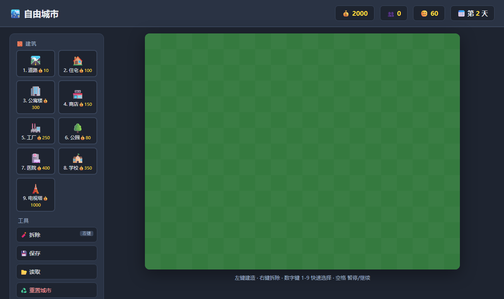

# 🏙️ 自由城市 · 城建沙盒

一个用纯原生网页技术实现的**自由城市建设沙盒游戏**。没有固定关卡，给你一片土地和一笔启动资金，想怎么建就怎么建——是打造工业帝国，还是宜居花园城市，全凭你发挥。



## ✨ 游戏特色

- 🧱 **9 种建筑**：道路、住宅、公寓楼、商店、工厂、公园、医院、学校、电视塔
- 💰 **经济系统**：每栋建筑有造价、收益、人口与幸福度影响，每 2 秒结算一天
- 😊 **相互制衡**：工厂赚钱但拉低幸福度，公园医院提升幸福度；**幸福度越高，每日收益加成越大**
- 🧨 **自由建造 / 拆除**：左键建造、右键拆除(返还 50%),随时改规划
- 💾 **本地存档**：一键保存 / 读取，关掉浏览器城市也不会丢
- ⌨️ **快捷键**：数字键 `1-9` 秒选建筑，`X` 切拆除，`空格` 暂停

## 🕹️ 玩法

1. 左侧选一种建筑(或按数字键)
2. 点击地图空格建造；右键或拆除工具移除
3. 看顶部资源：金钱会随每天结算增减，人口靠住宅，幸福度靠公园/医院
4. 平衡好「赚钱」和「宜居」,把小村庄经营成理想都市

| 操作 | 方式 |
|---|---|
| 建造 | 选中建筑后 **左键** 点击空格 |
| 拆除 | **右键** 点击建筑(返还 50%) |
| 快速选建筑 | 数字键 `1` ~ `9` |
| 拆除模式 | 按 `X` 或点「拆除」按钮 |
| 暂停 / 继续 | `空格` |
| 取消选择 | `Esc` |

## 🏗️ 建筑一览

| 建筑 | 造价 | 收益/天 | 人口 | 幸福度 |
|---|---|---|---|---|
| 🛣️ 道路 | 10 | — | — | — |
| 🏠 住宅 | 100 | — | +4 | — |
| 🏢 公寓楼 | 300 | — | +14 | -1 |
| 🏪 商店 | 150 | +8 | — | +1 |
| 🏭 工厂 | 250 | +22 | — | -7 |
| 🌳 公园 | 80 | — | — | +5 |
| 🏥 医院 | 400 | — | — | +3 |
| 🏫 学校 | 350 | — | — | +2 |
| 🗼 电视塔 | 1000 | +6 | — | +10 |

> 每日实际收益 =（建筑收益 + 人口×2 税收）×（0.5 + 幸福度/100）

## ️ 技术栈

- **HTML5** —— 页面结构 + `<canvas>` 地图
- **CSS3** —— Flex 布局、深色主题 UI
- **原生 JavaScript** —— 全部游戏逻辑，零依赖

## 📁 项目结构

```
city-builder/
├── index.html          页面骨架
├── style.css           界面样式
├── script.js           游戏核心逻辑
└── docs/
    └── screenshot.png  运行截图
```

## 🧠 核心实现思路

- **地图**是一个 `ROWS × COLS` 的二维数组，每格存建筑 id 或 `null`
- 任何建造/拆除后调用 `recomputeStats()` 遍历全图，重算人口与幸福度
- `setInterval` 每 2 秒执行一次 `tick()` 结算收益、推进天数
- `requestAnimationFrame` 驱动渲染循环，负责画草地、建筑和鼠标悬停的半透明「幽灵」预览
- 存档用 `localStorage` 序列化整个地图与资源状态

## 🚀 如何运行

无需安装任何东西：

1. 下载或克隆本仓库
2. 双击 `index.html` 用任意现代浏览器打开即可游玩

```bash
git clone https://github.com/guolifang58/city-builder.git
```

## 📄 License

MIT
